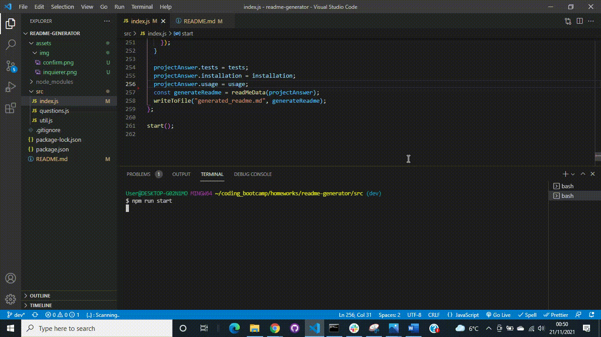
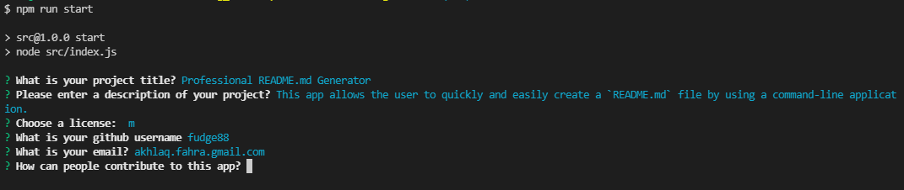

# Professional `README.md` Generator 

A command-line application that dynamically generates a professional `README.md` file.


## Summary

This app allows the user to quickly and easily create a `README.md` file by using a command-line application.

The answers are collected and dynamically generates a professional `README.md` file for the user. Thus allowing user to devote more time to working on the project, opposed to creating and formatting documentation in 'markdown'.



## User Story

```md
AS A developer
I WANT a README generator
SO THAT I can quickly create a professional README for a new project
```

## Acceptance Criteria

```md
GIVEN a command-line application that accepts user input
WHEN I am prompted for information about my application repository
THEN a high-quality, professional README.md is generated with the title of my project and sections entitled Description, Table of Contents, Installation, Usage, License, Contributing, Tests, and Questions
WHEN I enter my project title
THEN this is displayed as the title of the README
WHEN I enter a description, installation instructions, usage information, contribution guidelines, and test instructions
THEN this information is added to the sections of the README entitled Description, Installation, Usage, Contributing, and Tests
WHEN I choose a license for my application from a list of options
THEN a badge for that license is added near the top of the README and a notice is added to the section of the README entitled License that explains which license the application is covered under
WHEN I enter my GitHub username
THEN this is added to the section of the README entitled Questions, with a link to my GitHub profile
WHEN I enter my email address
THEN this is added to the section of the README entitled Questions, with instructions on how to reach me with additional questions
WHEN I click on the links in the Table of Contents
THEN I am taken to the corresponding section of the README
```

## Installation Instructions:

You are able to clone this repository, by clicking [here](https://github.com/fudge88/readme-generator) and then clicking on the `code` button. Select how you would like to clone the repository.

If you have your SSH keys set up, you are able to copy the link from the drop down and paste the following into your terminal application:

```
git clone git@github.com:fudge88/readme-generator.git
```

Then change your directory so you are now in your newly cloned project and then open the code in your chosen source-code editor.

You need to install all dependencies that are listed in the `package.json` file:

```
npm install --save
```

Check to see that the following code is in the `package.json`, this will ensure npm to 'start' the application from your entry file

```
"start": node src/index.js
```

## How to run the application:

To run the start script, use the following code in the terminal.

```
npm run start
```

This should start the application, and you will be prompted with questions in the terminal.



Once you have answered the questions, you will see a message of 'success' appear in the terminal and a dynamically generated 'generated_readme.md' file will appear in the root directory.

You can use the following code to save your changes:

```
git add .
```

```
git commit
```

```
git push
```

## Tools Used:

- node.js
- inquirer - npm

#### Languages:

- JavaScript
- JQuery

#### NPM Inquirer:

Inquirer is an NPM package that provides an easy way to capture user input in your Node. js command line interface applications. It provides several methods for asking questions and returning answers from the user that can be accessed by a . then promise function. In this project i have chosen to use async and await in various places to allow the smooth running of the app, but awaiting the completion of promises.

### References

[Mozilla.org](https://developer.mozilla.org/en-US/docs/)

[StackOverflow](https://stackoverflow.com/questions/)

[NPM Inquirer](https://www.npmjs.com/package/inquirer)

## License

This project is licensed under the terms of the MIT license.

## Questions

- If you have any questions about this project
- would like further information
- would like to report and issue

please contact me through the links below:

[GitHub](https://github.com/fudge88) Profile

Email: akhlaq.fahra@gmail.com
